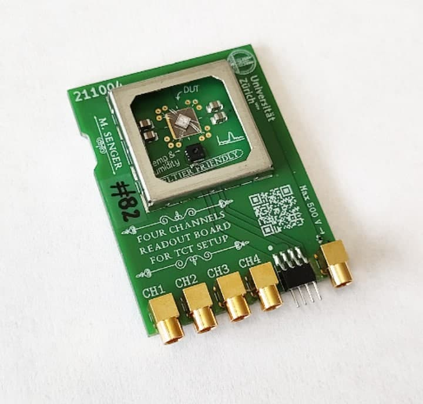

# Passive readout board for TCT

This repo contains the source files of a *4 channels passive readout board for TCT* which has incorporated a digital temperature and humidity sensor and is "Peltier friendly"¹ such that the temperature can be accurately controlled. The design is in [KiCad](https://www.kicad.org/). This board was designed, produced and used for the characterization of TI-LGADs.

- [Presentation at the 39th RD50 Workshop in Valencia, Spain](https://indico.cern.ch/event/1074989/contributions/4601936/).

## Footnotes

¹ I mean that it has a flat surface that can easily be put in contact with a Peltier cell, in addition to the temperature sensor.
